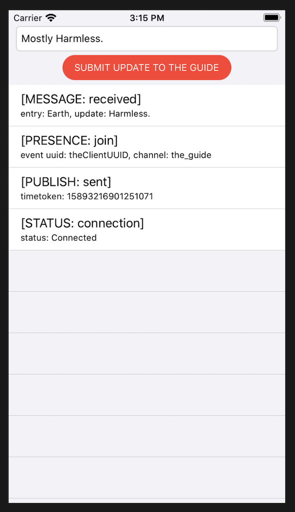

# PubNub Objective-C Sample App

This repository contains the files required to run the [PubNub Objective-C Quickstart](https://www.pubnub.com/docs/platform/quickstarts/objectivec).

PubNub takes care of the infrastructure and APIs needed for the realtime communication layer of your application. Work on your app's logic and let PubNub handle sending and receiving data across the world in less than 100ms.

## Get keys

You will need publish and subscribe keys to authenticate your app. Get your keys from the [Admin Portal](https://dashboard.pubnub.com/login).

## Set up the project

If you don't want to copy the code from this document, you can clone the repository and use the files in there.
 
1. Open Xcode and create a new iOS App.
2. Give it a Product Name, `pnquickstart_objc`.
3. Set User Interface to Storyboard.
4. Set the Language to Objective-C.
5. Use defaults for the rest of the options.
6. Save the project to your file system.
7. Navigate to File > New > File to create a new class:
   1. Select Cocoa Touch Class.
   2. From the drop-down, select UITableViewController.
   3. If not populated already, provide TableViewController as the name.
   4. Set Language to Objective-C.
   5. Use defaults for the rest of the options and save this class in the folder where the AppDelegate classes already exist.
8. Close Xcode.

### Install PubNub using CocoaPods

1. In a terminal window, navigate to the project's root folder.
2. Create an empty Podfile with `pod init` (this requires [CocoaPods 1.0.0 or higher](https://guides.cocoapods.org/using/getting-started.html)).
3. Open Podfile in a text editor, and add pod `"PubNub", "~> 4"` to the target section. The target name must be the same as your project name. If you didn't use the suggested name in this quickstart, use the name you specified. The following is the required minimum:

    ```text
    platform :ios, '9.0'

    target 'pnqs_ios_objectivec' do
        use_frameworks!
        pod "PubNub", "~> 4"
    end
    ```

4. Save the Podfile and quit the text editor.
5. In the directory where the podfile exists, run the `pod install` command to install the dependencies.

## Add project files

If you don't want to copy the code from this document, you can clone the repository and use the files in there.

1. Open the `Main.storyboard` file as source code and replace the existing code with the following:

    ```xml
    <?xml version="1.0" encoding="UTF-8"?>
    <document type="com.apple.InterfaceBuilder3.CocoaTouch.Storyboard.XIB" version="3.0" toolsVersion="16096" targetRuntime="iOS.CocoaTouch" propertyAccessControl="none" useAutolayout="YES" useTraitCollections="YES" useSafeAreas="YES" colorMatched="YES" initialViewController="LAK-qH-Nn6">
        <device id="ipad9_7" orientation="portrait" layout="fullscreen" appearance="light"/>
        <dependencies>
            <plugIn identifier="com.apple.InterfaceBuilder.IBCocoaTouchPlugin" version="16087"/>
            <capability name="Safe area layout guides" minToolsVersion="9.0"/>
            <capability name="documents saved in the Xcode 8 format" minToolsVersion="8.0"/>
        </dependencies>
        <scenes>
            <!--Table View Controller-->
            <scene sceneID="xgk-RU-1AJ">
                <objects>
                    <tableViewController automaticallyAdjustsScrollViewInsets="NO" modalPresentationStyle="currentContext" id="LAK-qH-Nn6" customClass="TableViewController" sceneMemberID="viewController">
                        <tableView key="view" clipsSubviews="YES" contentMode="scaleToFill" directionalLockEnabled="YES" alwaysBounceVertical="YES" showsHorizontalScrollIndicator="NO" contentInsetAdjustmentBehavior="always" dataMode="prototypes" style="plain" separatorStyle="default" sectionIndexMinimumDisplayRowCount="1" rowHeight="-1" estimatedRowHeight="-1" sectionHeaderHeight="28" sectionFooterHeight="28" contentViewInsetsToSafeArea="NO" id="LP5-kA-xUV">
                            <rect key="frame" x="0.0" y="0.0" width="768" height="1024"/>
                            <autoresizingMask key="autoresizingMask" widthSizable="YES" heightSizable="YES"/>
                            <color key="backgroundColor" cocoaTouchSystemColor="groupTableViewBackgroundColor"/>
                            <inset key="separatorInset" minX="0.0" minY="0.0" maxX="0.0" maxY="0.0"/>
                            <prototypes>
                                <tableViewCell clipsSubviews="YES" contentMode="scaleToFill" preservesSuperviewLayoutMargins="YES" selectionStyle="default" indentationWidth="0.0" reuseIdentifier="cellIdentifier" textLabel="JAi-Mi-vIi" detailTextLabel="AEP-Kb-8Vi" style="IBUITableViewCellStyleSubtitle" id="yR8-Pd-6HP">
                                    <rect key="frame" x="0.0" y="28" width="768" height="55.5"/>
                                    <autoresizingMask key="autoresizingMask"/>
                                    <tableViewCellContentView key="contentView" opaque="NO" clipsSubviews="YES" multipleTouchEnabled="YES" contentMode="center" preservesSuperviewLayoutMargins="YES" insetsLayoutMarginsFromSafeArea="NO" tableViewCell="yR8-Pd-6HP" id="Kv5-xQ-hK3">
                                        <rect key="frame" x="0.0" y="0.0" width="768" height="55.5"/>
                                        <autoresizingMask key="autoresizingMask"/>
                                        <subviews>
                                            <label opaque="NO" multipleTouchEnabled="YES" contentMode="left" insetsLayoutMarginsFromSafeArea="NO" text="Title" textAlignment="natural" lineBreakMode="tailTruncation" baselineAdjustment="alignBaselines" adjustsFontSizeToFit="NO" id="JAi-Mi-vIi">
                                                <rect key="frame" x="20" y="10" width="33.5" height="20.5"/>
                                                <autoresizingMask key="autoresizingMask"/>
                                                <fontDescription key="fontDescription" type="system" pointSize="17"/>
                                                <nil key="textColor"/>
                                                <nil key="highlightedColor"/>
                                            </label>
                                            <label opaque="NO" multipleTouchEnabled="YES" contentMode="left" insetsLayoutMarginsFromSafeArea="NO" text="Detail" textAlignment="natural" lineBreakMode="tailTruncation" baselineAdjustment="alignBaselines" adjustsFontSizeToFit="NO" id="AEP-Kb-8Vi">
                                                <rect key="frame" x="20" y="31.5" width="33" height="14.5"/>
                                                <autoresizingMask key="autoresizingMask"/>
                                                <fontDescription key="fontDescription" type="system" pointSize="12"/>
                                                <nil key="textColor"/>
                                                <nil key="highlightedColor"/>
                                            </label>
                                        </subviews>
                                    </tableViewCellContentView>
                                </tableViewCell>
                            </prototypes>
                            <sections/>
                            <connections>
                                <outlet property="dataSource" destination="LAK-qH-Nn6" id="knM-MJ-NhS"/>
                                <outlet property="delegate" destination="LAK-qH-Nn6" id="1P7-6E-fkL"/>
                            </connections>
                        </tableView>
                        <extendedEdge key="edgesForExtendedLayout"/>
                        <nil key="simulatedTopBarMetrics"/>
                        <connections>
                            <outlet property="entryUpdateText" destination="Ern-0q-jxX" id="Suu-dP-MKb"/>
                            <outlet property="updateInputHolderView" destination="UIL-nC-z3d" id="J9B-mg-utA"/>
                        </connections>
                    </tableViewController>
                    <placeholder placeholderIdentifier="IBFirstResponder" id="kQX-jw-plL" userLabel="First Responder" customClass="UIResponder" sceneMemberID="firstResponder"/>
                    <view clipsSubviews="YES" contentMode="scaleToFill" id="UIL-nC-z3d" userLabel="Table Header">
                        <rect key="frame" x="0.0" y="0.0" width="414" height="101"/>
                        <autoresizingMask key="autoresizingMask" widthSizable="YES"/>
                        <subviews>
                            <view contentMode="scaleToFill" horizontalHuggingPriority="750" verticalHuggingPriority="1000" translatesAutoresizingMaskIntoConstraints="NO" id="Wj9-0j-ZrE" userLabel="Input Holder">
                                <rect key="frame" x="-62.5" y="21" width="539" height="59"/>
                                <subviews>
                                    <textField opaque="NO" contentMode="scaleToFill" verticalHuggingPriority="1000" contentHorizontalAlignment="left" contentVerticalAlignment="center" text="Mostly Harmless." borderStyle="roundedRect" textAlignment="natural" minimumFontSize="17" translatesAutoresizingMaskIntoConstraints="NO" id="Ern-0q-jxX" userLabel="Message input">
                                        <rect key="frame" x="0.0" y="20" width="300" height="34"/>
                                        <constraints>
                                            <constraint firstAttribute="width" relation="greaterThanOrEqual" constant="300" id="1y9-ql-3EM"/>
                                            <constraint firstAttribute="height" constant="34" id="6kR-Ob-HnJ"/>
                                            <constraint firstAttribute="width" relation="lessThanOrEqual" constant="1200" id="Qcs-lc-V6o"/>
                                        </constraints>
                                        <fontDescription key="fontDescription" type="system" pointSize="14"/>
                                        <textInputTraits key="textInputTraits" autocapitalizationType="sentences" autocorrectionType="no" returnKeyType="send" enablesReturnKeyAutomatically="YES"/>
                                        <connections>
                                            <outlet property="delegate" destination="LAK-qH-Nn6" id="BeL-kG-fNh"/>
                                        </connections>
                                    </textField>
                                    <button opaque="NO" contentMode="scaleToFill" horizontalHuggingPriority="1000" contentHorizontalAlignment="center" contentVerticalAlignment="center" lineBreakMode="middleTruncation" translatesAutoresizingMaskIntoConstraints="NO" id="HNa-TI-hGa" userLabel="Send button">
                                        <rect key="frame" x="310" y="20" width="229" height="34"/>
                                        <color key="backgroundColor" systemColor="systemRedColor" red="1" green="0.23137254900000001" blue="0.18823529410000001" alpha="1" colorSpace="custom" customColorSpace="sRGB"/>
                                        <constraints>
                                            <constraint firstAttribute="width" relation="greaterThanOrEqual" constant="229" id="ICx-1a-fHf"/>
                                            <constraint firstAttribute="height" constant="34" id="Q1j-dE-IZa"/>
                                        </constraints>
                                        <fontDescription key="fontDescription" type="system" pointSize="13"/>
                                        <inset key="contentEdgeInsets" minX="0.0" minY="10" maxX="0.0" maxY="10"/>
                                        <state key="normal" title="SUBMIT UPDATE TO THE GUIDE"/>
                                        <userDefinedRuntimeAttributes>
                                            <userDefinedRuntimeAttribute type="number" keyPath="layer.cornerRadius">
                                                <integer key="value" value="17"/>
                                            </userDefinedRuntimeAttribute>
                                        </userDefinedRuntimeAttributes>
                                        <connections>
                                            <action selector="sendButtonTapped:" destination="LAK-qH-Nn6" eventType="touchUpInside" id="uel-US-CbY"/>
                                        </connections>
                                    </button>
                                </subviews>
                                <color key="backgroundColor" cocoaTouchSystemColor="groupTableViewBackgroundColor"/>
                                <constraints>
                                    <constraint firstItem="Ern-0q-jxX" firstAttribute="leading" secondItem="Wj9-0j-ZrE" secondAttribute="leading" priority="750" id="2Zz-Be-R87"/>
                                    <constraint firstItem="HNa-TI-hGa" firstAttribute="centerX" secondItem="Wj9-0j-ZrE" secondAttribute="centerX" id="53v-S9-znW"/>
                                    <constraint firstAttribute="trailing" secondItem="Ern-0q-jxX" secondAttribute="trailing" id="Aeb-6h-JVY"/>
                                    <constraint firstItem="Ern-0q-jxX" firstAttribute="top" secondItem="Wj9-0j-ZrE" secondAttribute="top" constant="20" id="Dgy-Om-kQu"/>
                                    <constraint firstAttribute="bottom" secondItem="HNa-TI-hGa" secondAttribute="bottom" constant="5" id="Gr5-Vz-x9f"/>
                                    <constraint firstItem="HNa-TI-hGa" firstAttribute="top" secondItem="Ern-0q-jxX" secondAttribute="bottom" constant="5" id="ROn-gk-UC7"/>
                                    <constraint firstItem="Ern-0q-jxX" firstAttribute="centerX" secondItem="Wj9-0j-ZrE" secondAttribute="centerX" id="gu1-dH-wnm"/>
                                    <constraint firstItem="HNa-TI-hGa" firstAttribute="leading" secondItem="Ern-0q-jxX" secondAttribute="trailing" constant="10" id="kgm-eC-2ei"/>
                                    <constraint firstItem="HNa-TI-hGa" firstAttribute="top" secondItem="Wj9-0j-ZrE" secondAttribute="top" constant="20" id="pV8-uR-PjW"/>
                                    <constraint firstAttribute="trailing" secondItem="HNa-TI-hGa" secondAttribute="trailing" id="yoc-7o-j1b"/>
                                </constraints>
                                <variation key="default">
                                    <mask key="constraints">
                                        <exclude reference="kgm-eC-2ei"/>
                                        <exclude reference="pV8-uR-PjW"/>
                                        <exclude reference="yoc-7o-j1b"/>
                                    </mask>
                                </variation>
                                <variation key="heightClass=regular-widthClass=regular">
                                    <mask key="constraints">
                                        <exclude reference="Aeb-6h-JVY"/>
                                        <exclude reference="gu1-dH-wnm"/>
                                        <exclude reference="53v-S9-znW"/>
                                        <exclude reference="ROn-gk-UC7"/>
                                        <include reference="kgm-eC-2ei"/>
                                        <include reference="pV8-uR-PjW"/>
                                        <include reference="yoc-7o-j1b"/>
                                    </mask>
                                </variation>
                            </view>
                        </subviews>
                        <color key="backgroundColor" cocoaTouchSystemColor="groupTableViewBackgroundColor"/>
                        <constraints>
                            <constraint firstItem="Wj9-0j-ZrE" firstAttribute="leading" relation="lessThanOrEqual" secondItem="UIL-nC-z3d" secondAttribute="leading" priority="750" constant="10" id="5ty-zC-a75"/>
                            <constraint firstAttribute="trailing" relation="lessThanOrEqual" secondItem="Wj9-0j-ZrE" secondAttribute="trailing" priority="750" constant="10" id="Ke1-0f-LUi"/>
                            <constraint firstItem="Wj9-0j-ZrE" firstAttribute="centerY" secondItem="UIL-nC-z3d" secondAttribute="centerY" id="hrH-JJ-KkL"/>
                            <constraint firstItem="Wj9-0j-ZrE" firstAttribute="centerX" secondItem="UIL-nC-z3d" secondAttribute="centerX" id="wuf-Hh-X6Y"/>
                        </constraints>
                        <viewLayoutGuide key="safeArea" id="MSA-4V-ltd"/>
                    </view>
                </objects>
                <point key="canvasLocation" x="137.68115942028987" y="-535.04464285714278"/>
            </scene>
        </scenes>
    </document>
    ```

2. Open the `TableViewController.m` file and replace the existing code with the following. Remember to also replace the _myPublishKey_ and _mySubscribeKey_ placeholders with your keys.

    ```objectivec
    #import "TableViewController.h"
    #import <PubNub/PubNub.h>

    #pragma mark Statics

    static NSString * const kUpdateCellIdentifier = @"cellIdentifier";
    static NSString * const kUpdateEntryMessage = @"entryMessage";
    static NSString * const kUpdateEntryType = @"entryType";
    static NSString * const kChannelGuide = @"the_guide";
    static NSString * const kEntryEarth = @"Earth";

    NS_ASSUME_NONNULL_BEGIN

    #pragma mark - Private interface declaration

    @interface TableViewController () <UITextFieldDelegate, PNObjectEventListener>

    @property (nonatomic, strong) PubNub *pubnub;
    @property (nonatomic, weak) IBOutlet UIView *updateInputHolderView;
    @property (nonatomic, weak) IBOutlet UITextField *entryUpdateText;
    @property (nonatomic, strong) NSMutableArray<NSDictionary *> *messages;

    #pragma mark -

    @end

    NS_ASSUME_NONNULL_END

    #pragma mark - Interface implementation

    @implementation TableViewController

    #pragma mark - Controller & view life cycle

    - (void)awakeFromNib {
        [super awakeFromNib];

        // replace the key placeholders with your own PubNub publish and subscribe keys
        PNConfiguration *pnconfig = [PNConfiguration configurationWithPublishKey:@"myPublishKey"
                                                                    subscribeKey:@"mySubscribeKey"];
        pnconfig.uuid = @"theClientUUID";
        self.pubnub = [PubNub clientWithConfiguration:pnconfig];

        [self.pubnub addListener:self];
        [self.pubnub subscribeToChannels: @[kChannelGuide] withPresence:YES];

        self.messages = [NSMutableArray new];
    }

    - (void)viewDidLoad {
        [super viewDidLoad];

        // Adjust table view content inset under translucent status bar
        UIWindowScene *windowScene = UIApplication.sharedApplication.windows[0].windowScene;
        CGFloat statusBarHeight = windowScene.statusBarManager.statusBarFrame.size.height;
        self.tableView.contentInset = UIEdgeInsetsMake(-statusBarHeight, 0.0f, 0.0f, 0.0f);
    }

    #pragma mark - Updates sending

    - (void)submitUpdate:(NSString *)update forEntry:(NSString *)entry toChannel:(NSString *)channel {
        [self.pubnub publish: @{ @"entry": entry, @"update": update } toChannel:kChannelGuide
            withCompletion:^(PNPublishStatus *status) {

            NSString *text = [@"timetoken: " stringByAppendingString:status.data.timetoken.stringValue];
            [self displayMessage:text asType:@"[PUBLISH: sent]"];
        }];
    }

    - (void)displayMessage:(NSString *)message asType:(NSString *)type {
        NSDictionary *updateEntry = @{ kUpdateEntryType: type, kUpdateEntryMessage: message };
        [self.messages insertObject:updateEntry atIndex:0];
        NSIndexPath *indexPath = [NSIndexPath indexPathForRow:0 inSection:0];

        [self.tableView beginUpdates];
        [self.tableView insertRowsAtIndexPaths:@[indexPath]
                            withRowAnimation:UITableViewRowAnimationBottom];

        [self.tableView endUpdates];
    }

    - (IBAction)sendButtonTapped:(id)sender {
        NSLog(@"Button Pressed");

        if (self.entryUpdateText.text.length > 0) {
            [self submitUpdate:self.entryUpdateText.text forEntry:kEntryEarth toChannel:kChannelGuide];
            self.entryUpdateText.text = nil;
        }
        else {
            NSLog(@"Message field is empty.");
        }

        [self.entryUpdateText resignFirstResponder];
    }

    #pragma mark - PubNub event listeners

    - (void)client:(PubNub *)pubnub didReceiveMessage:(PNMessageResult *)event {
        NSString *text = [NSString stringWithFormat:@"entry: %@, update: %@",
                        event.data.message[@"entry"],
                        event.data.message[@"update"]];

        [self displayMessage:text asType:@"[MESSAGE: received]"];
    }

    - (void)client:(PubNub *)pubnub didReceivePresenceEvent:(PNPresenceEventResult *)event {
        NSString *text = [NSString stringWithFormat:@"event uuid: %@, channel: %@",
                        event.data.presence.uuid,
                        event.data.channel];

        NSString *type = [NSString stringWithFormat:@"[PRESENCE: %@]", event.data.presenceEvent];
        [self displayMessage:text asType: type];
    }

    - (void)client:(PubNub *)pubnub didReceiveStatus:(PNStatus *)event {
        NSString *text = [NSString stringWithFormat:@"status: %@", event.stringifiedCategory];

        [self displayMessage:text asType:@"[STATUS: connection]"];
        [self submitUpdate:@"Harmless." forEntry:kEntryEarth toChannel:kChannelGuide];
    }

    #pragma mark - Text field delegate

    - (BOOL)textFieldShouldReturn:(UITextField *)textField {
        [self sendButtonTapped:nil];
        return YES;
    }

    #pragma mark - Table view delegate

    - (CGFloat)tableView:(UITableView *)tableView heightForHeaderInSection:(NSInteger)section {
        return self.updateInputHolderView.frame.size.height;
    }

    - (UIView *)tableView:(UITableView *)tableView viewForHeaderInSection:(NSInteger)section {
        return self.updateInputHolderView;
    }

    - (NSInteger)numberOfSectionsInTableView:(UITableView *)tableView {
        return 1;
    }

    - (NSInteger)tableView:(UITableView *)tableView numberOfRowsInSection:(NSInteger)section {
        return self.messages.count;
    }

    - (void)tableView:(UITableView *)tableView willDisplayCell:(UITableViewCell *)cell forRowAtIndexPath:(NSIndexPath *)indexPath {
        NSDictionary *updateEntry = [self.messages objectAtIndex:indexPath.row];
        cell.detailTextLabel.text = updateEntry[kUpdateEntryMessage];
        cell.textLabel.text = updateEntry[kUpdateEntryType];
    }

    - (UITableViewCell *)tableView:(UITableView *)tableView cellForRowAtIndexPath:(NSIndexPath *)indexPath {
        return [tableView dequeueReusableCellWithIdentifier:kUpdateCellIdentifier];
    }

    #pragma mark -

    @end
    ```

At this point, the code is syntactically correct, but Xcode might display warnings about the PubNub import, and any code that depends on the PubNub SDK. If this happens, close Xcode and open the workspace (not the project) again. Choose Product > Clean Build Folder, and then Product > Build. 

## Run the app

1. Click the Run button.

    You should see the iPhone simulator that displays a screen similar to this:

    

    The UI is simple but uses a list view that cleanly displays each event.

    A message was published on app start up and some other events were displayed.

2. Submit a new entry.

    A new entry update is auto populated for you: "Mostly Harmless." Change the text then click the Submit Update to the Guide button to publish the new update. The new update appears at the top of the current messages, while the older messages scroll down, and the entry update field is cleared for you to enter something new.

    > This code is executed asynchronously, so the order in which the [MESSAGE: received] and [PUBLISH: sent] messages appear may vary.

## Documentation

* [Build your first realtime Objective-C app with PubNub](https://www.pubnub.com/docs/platform/quickstarts/objectivec)
* [API reference for Objective-C (iOS)](https://www.pubnub.com/docs/ios-objective-c)
* [API reference for Objective-C (Cocoa)](https://www.pubnub.com/docs/cocoa-objective-c/api-reference-configuration)

## Support

If you **need help** or have a **general question**, contact support@pubnub.com.
